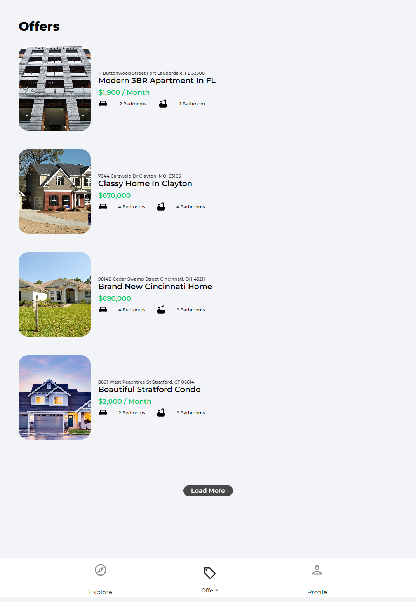

##### Table of Contents

[Links](#links)  
[Description](#description)  
[Tools](#tools)  
[Screenshots](#screenshots)  
[Setup](#setup)  
[Development](#development)

# Links

- Live Site URL: https://house-marketplace-react-lovat.vercel.app

# Description

This is a fake house market place made with react as a practice.

Users Can:

- View the optimal layout for the App depending on their devices.
- View the available houses for rent and for sell.
- Sign in or sign up.
- Add new house for rent or for sell, and edit or remove it.

# Tools

- HTML
- CSS
- React
- Firebase
- Leaflet Maps
- React Toastify
- Swiper Slides

# Screenshots

 
 

# Setup

Make sure to install the dependencies:

```bash
# yarn
yarn install

# npm
npm install
```

# Development

Start the development server on `http://localhost:3000`

```bash
npm start
```
